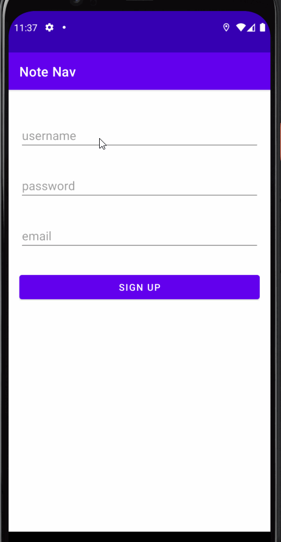
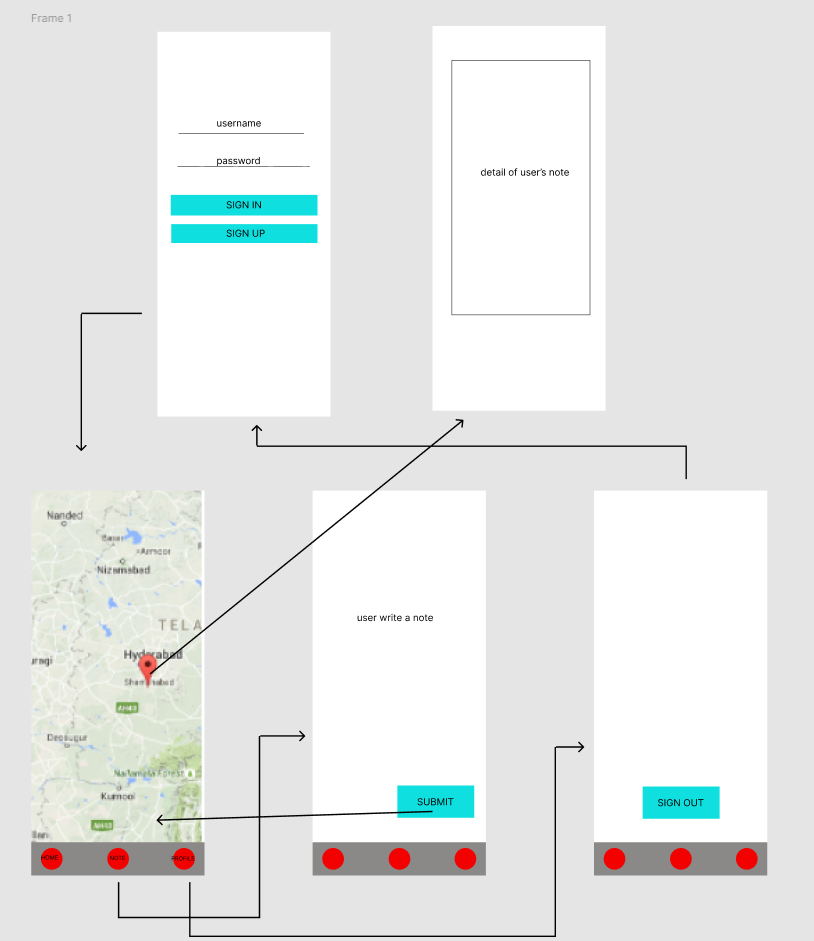
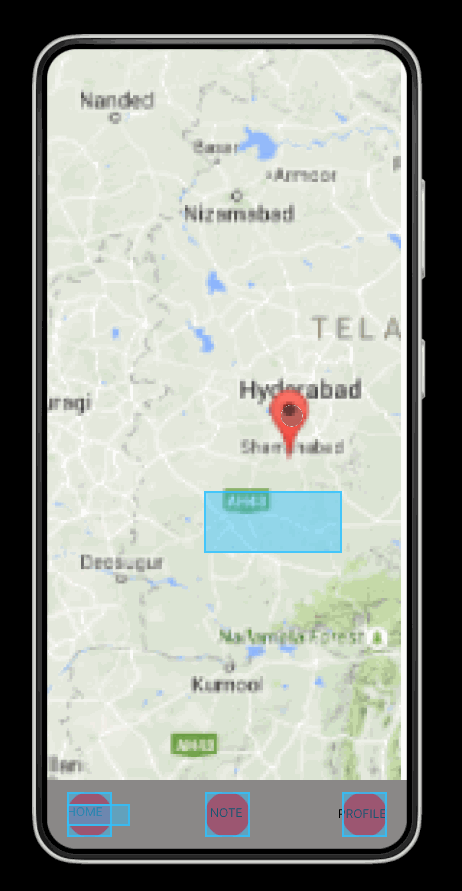

Original App Design Project
===

# NoteNav

## Table of Contents
1. [Overview](#Overview)
1. [Product Spec](#Product-Spec)
1. [Wireframes](#Wireframes)
2. [Schema](#Schema)

## Overview
### Description
Virtual note where shows the place that the user visits and makes a note.

### App Evaluation
- **Category:** Social Networking
- **Mobile:** For mobiles/tablets
- **Story:** Users can make a note and record their location
- **Market:** Any individual could choose to use this app
- **Habit:** This app could be used as often as the user wanted
- **Scope:** We start with making virtual note on the place user visit. Potential this can be used for tourism/business purposes

## Product Spec

### 1. User Stories (Required and Optional)

**Required Must-have Stories**

* [X] User can Log in to their account
* [X] User can Sign up 
* [X] User can Log out 
* [X] User sees a map around their location with markers on it
* [ ] User clicks on a marker to see the detail of the note at that location
* [ ] User makes a note with text 


**Optional Nice-to-have Stories**

* User can also add picture in note
* User can edit profile picture
* User can change name

#### Demo



### 2. Screen Archetypes

* Login/Sign Up screen
   * Users sign up or logs into their account
* Map screen
   * User sees a map around their location with markers on it
   * User clicks on a marker to see the detail of the note at that location
* Note screen
   * User makes a note with text and/or picture 
   * User submits the note 
* Profile screen
   * User logs out
   * User edits profile picture
   * User changes name
* Detail screen
   * User views the detail of a note

### 3. Navigation

**Tab Navigation** (Tab to Screen)

* Map
* Note
* Profile

**Flow Navigation** (Screen to Screen)

* Login/Sign Up screen
   * Map screen
* Map screen
   * Detail screen
   * Note screen
   * Profile screen
* Note screen
   * Map screen
   * Profile screen
* Profile screen
   * Map screen
   * Profile screen
   * Login/Sign Up screen
* Detail screen
   * Map screen

## Wireframes

### Digital Wireframes & Mockups


### Interactive Prototype


## Schema 
### Models
#### Post

   | Property      | Type     | Description |
   | ------------- | -------- | ------------|
   | objectId      | String   | unique id for the user post (default field) |
   | User        | Pointer to User| note's author |
   | Title         | String     |  note's title  |
   | Detail       | String   | note's detail |
   | createdAt     | DateTime | date when post is created (default field) |
   | updatedAt     | DateTime | date when post is last updated (default field) |
### Networking
#### List of network requests by screen

   - LoginSignUp screen
      - Log In
          ```kotlin
             ParseUser.logInInBackground(userName,password,object:LogInCallback{
                  override fun done(user: ParseUser?, e: ParseException?) {
                      if (e != null){
                          //todo error handling
                          return
                      }
                      //todo after user logged in
                  }
            })
          ```
      - (Create/POST) Create a new user
         ```kotlin
            val user: ParseUser = ParseUser()
            user.username = userName
            user.setPassword(password)
            user.signUpInBackground {
              override fun done(e: ParseException?) {
                if (e!=null){
                    //todo with error handling
                    return
                }
                //todo after create user    
            }
         ```
   - Home Feed Screen
      - (Read/GET) Query all posts where user is author
         ```kotlin
          val query : ParseQuery<Post> = ParseQuery.getQuery(Post::class.java)
          query.include(Post.KEY_USER)
          query.addDescendingOrder(Post.CREATE_AT)
          query.findInBackground(object: FindCallback<Post>{
            override fun done(fetchedPosts: MutableList<Post>?, e: ParseException?) {
                if (e!=null){
                    //todo with error handling
                    return
                }
                //todo with data
           }
         ```
   - Create Note Screen
      - (Create/POST) Create a new note object
         ```kotlin
            val post = Post()
            //set data for post
            post.saveInBackground {
                //todo after create post
            }
           ```
   - Profile Screen
      -  logged out user object
          ```kotlin
            ParseUser.logOut()
          ```
   - Note Detail Screen
      - (Create/POST) Create a new note object
         ```kotlin
          val query : ParseQuery<Post> = ParseQuery.getQuery(Post::class.java)
          query.include(Post.KEY_USER)
          query.getInBackground(objectId, object: FindCallback<Post>{
            override fun done(fetchedPosts: MutableList<Post>?, e: ParseException?) {
                if (e!=null){
                    //todo with error handling
                    return
                }
                //todo with data
           }
         ```  
#### [OPTIONAL:] Existing API Endpoints

